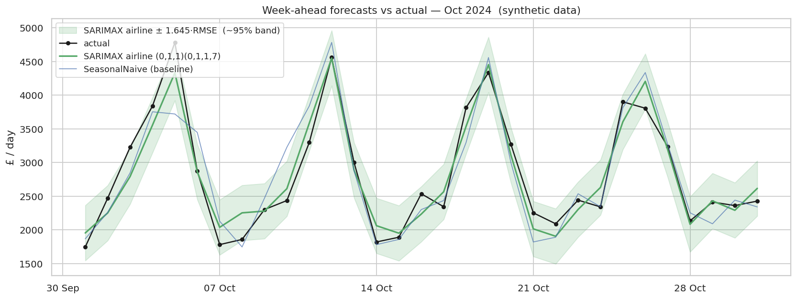

# Sales Forecasting — UK Sports Bar

Week-ahead daily-sales forecasting for a single UK sports bar, framed as the stock-ordering and rota-planning decision it actually supports.

> ⚠️ **The data is synthetic.** No real takings are used. The dataset is generated by a documented, seeded script in this repository (`src/generate_data.py`) and engineered to reproduce the demand structure of a UK sports bar — weekly rhythm, annual rhythm, football-fixture and bank-holiday spikes, heteroscedastic noise. It does not represent any real business's figures.



A week-ahead forecast lands at **mean MAE ≈ £204/day, MASE 0.66 — a ~30% reduction in mean absolute error against the seasonal-naive baseline.** Good but not magic — see [Limitations](#limitations).

## Overview

A single-venue, short-series forecasting study built on a transparent synthetic dataset, framed around the ordering and rostering decision a bar manager makes a week ahead. The recommended model is **SARIMAX airline `(0,1,1)(0,1,1,7)`** with the event flags `is_match_day`, `match_importance`, and `is_bank_holiday` as known-future exogenous regressors. It is operationally tied with Prophet — they are not in competition — and clearly ahead of a deliberately modest LSTM.

The horizon is one week to match the real ordering and rostering decision; longer horizons widen quickly and aren't the design target. This is not a benchmark of forecasting methods on UK hospitality data, and not a generalisation claim about which model is best on any other dataset.

## Approach

**Part 1 — Synthetic Data** (`src/generate_data.py`). Sales are generated as `baseline + trend + weekly_season + annual_season + event_effects + heteroscedastic_noise`, fully seeded. 1,096 daily rows (2022-01-01 → 2024-12-31). Bank holidays come from the real England & Wales calendar via the `holidays` library; the football schedule is plausible but invented (weekday-conditioned Bernoulli draws over an Aug–May season; fixture importance from `Beta(2, 5)`). The generator's component columns ship in the CSV for EDA verification only and are never model features.

**Part 2 — EDA and Decomposition** (`notebooks/01_exploratory-analysis.ipynb`). The series is MSTL-decomposed with periods `(7, 365)` and verified against the generator's ground-truth columns. Trend and weekly seasonality recover at Pearson r ≈ 0.99; the annual recovery is partial because MSTL absorbs day-of-year-recurring calendar events into the annual signal — a real and worth-knowing property of the method on calendar-event data, not a defect. ADF + KPSS + ACF/PACF motivate the SARIMA orders (d = 1, D = 1, m = 7).

**Part 3 — Modelling Under One Shared CV** (`notebooks/02_modelling.ipynb`, `src/models.py`, `src/evaluation.py`). Four models — SeasonalNaive, SARIMAX (three candidate orders), Prophet, LSTM — through one shared rolling-origin CV harness: horizon `h = 7`, expanding window, 26 weekly origins. The MASE denominator is each fold's in-sample, training-only seasonal-naive error; the test set never enters the scale. Two correctness gates ran before any model comparison was admitted:
- **Sanity** — seasonal-naive scored under CV sits near 1.0 as required (the small gap reflects the held-out span being slightly more regular than the training-average seasonal step).
- **Cross-check** — the hand-rolled MASE matches `utilsforecast.losses.mase` to floating-point tolerance (max diff 3.3 × 10⁻¹⁶ across all 26 folds).

**Part 4 — Evaluation and Equal-Accuracy Tests** (`notebooks/03_evaluation.ipynb`). Diebold-Mariano tests (HLN small-sample correction; Bartlett LRV, truncation `h − 1`) on both per-day absolute errors and per-fold MASE. Results live in [Key Findings](#key-findings).

**Part 5 — Operational Forecast** (`src/forecast.py`). A thin facade over the chosen airline SARIMAX. Takes a history series, the matching event flags, and the known-future event flags for the horizon; returns the daily forecast with a 95% prediction interval. The model code is imported from `src/models.py` — single source of truth.

```python
from src.forecast import forecast_next_weeks, REQUIRED_EXOG_COLS
import pandas as pd

df = (pd.read_csv("data/sales.csv", comment="#", parse_dates=["date"])
        .set_index("date").asfreq("D"))
fc = forecast_next_weeks(
    history      = df["sales"].iloc[:-14],
    history_exog = df[list(REQUIRED_EXOG_COLS)].iloc[:-14],
    future_exog  = df[list(REQUIRED_EXOG_COLS)].iloc[-14:],
    n_weeks      = 2,
)
# → DataFrame: date, forecast, lower, upper
```

## Key Results

| Model | MASE Mean | MAE (£/day) | RMSE (£/day) | vs SeasonalNaive (MAE) |
|---|---:|---:|---:|---:|
| **SARIMAX airline `(0,1,1)(0,1,1,7)`** — recommended | 0.662 | £204 | £249 | **−30%** |
| SARIMAX +AR(1) `(1,1,1)(0,1,1,7)` | 0.660 | £204 | £248 | −30% |
| Prophet | 0.643 | £198 | £238 | −32% |
| LSTM (deliberately modest) | 0.777 | £240 | £300 | −18% |
| SeasonalNaive (baseline) | 0.946 | £292 | £370 | 0% |

Twenty-six expanding-window weekly folds, horizon `h = 7`, MASE scaled against each fold's in-sample seasonal-naive error (`m = 7`). Prophet's headline edge over SARIMAX is within the noise band — see [Key Findings](#key-findings).

A ~£204/day mean absolute error week ahead is roughly 5–10% of a typical day depending on volume, and reduces mean absolute error by ~30% against the seasonal-naive baseline.

## Key Findings

**Everything beats the seasonal-naive baseline, but not by magic.** The three serious contenders cluster at MASE ≈ 0.65–0.66 — a ~30% reduction in mean absolute error. The gap is real and useful, not transformative.

**Prophet and SARIMAX are statistically tied.** Diebold-Mariano cannot reject equal accuracy (daily p = 0.31, per-fold p = 0.38). The two methods that *properly use known-future event regressors* land on the same accuracy plane within the noise of this 26-fold experiment. I recommend the **airline `(0,1,1)(0,1,1,7)` on parsimony** — one fewer parameter than the +AR(1), lower AIC, and the order the ACF/PACF pointed at. The +AR(1) edges the airline by 0.0014 in MASE (≈ £0.45/day in absolute error) — marginally significant statistically, operationally invisible.

**The LSTM lands behind at MASE 0.78.** Two factors contribute and I don't attempt to partition the gap between them:
- **One short single series** starves a high-capacity network of the cross-learning it needs. M4 saw no pure-ML entry beat the simple combination benchmark and only one beat the naive — Montero-Manso & Hyndman (2021) explains the mechanism. M5 reversed the result, but only with thousands of series and global models.
- **Regressor-access asymmetry.** The `LSTMModel` uses a direct h-step Dense head and does not consume future event flags at predict time — SARIMAX and Prophet do. The LSTM is forecasting next week without being told that Saturday is Boxing Day.

A future-regressor LSTM variant (seq2seq with a future-feature decoder, or a Dense head concatenating future flags) could test which factor dominates. Noted as future work; I didn't build it because the brief asked for an honest test of a modest LSTM, not a tuning exercise to force a win.

**~£204/day mean absolute error → ordering and rota numbers.** A 95% safety-stock cushion of roughly `1.645 × RMSE ≈ £409/day` on top of the forecast, ≈ 14% of an average day. That cushion is an approximate 95% cover assuming roughly normal errors; the band is well-calibrated on ordinary weeks and runs too tight on event nights.

## Limitations

**`is_bank_holiday` is one flag. The model learns an averaged uplift.** The generator has Christmas Day at −30% (quiet) and Boxing Day at +40% (big football day). The model can't tell them apart. From the runnable example (`python -m src.forecast`):

```
2024-12-25   forecast £3,135   actual £2,181   error  +£954
2024-12-26   forecast £3,458   actual £4,465   error −£1,006
```

The forecast over-shoots Christmas Day and under-shoots Boxing Day by ~£1,000 each. Including those two days, MAE on the 14-day Dec-18 → Dec-31 window is £330/day vs the £204/day CV average. A real fix is a richer holiday encoding (per-name flags, or Prophet-style holiday components) rather than one binary — I didn't retrofit that here.

**Prediction intervals assume roughly normal one-step errors.** The 95% band comes from the SARIMAX state-space variance — a Gaussian approximation. The same Christmas Day above makes the limitation concrete: the actual £2,181 falls below the model's own 95% lower bound of £2,594, not just below the point forecast. On ordinary weeks the band works as advertised; on event nights — cup-final shocks, weather-driven swings, one-off closures — the tails run wider than the model implies. The interval is plan-level cover, not a tail-risk guarantee.

**Single venue, single synthetic series.** The result generalises to venues with the same demand structure — UK sports bar, weekly + annual rhythm, fixture and bank-holiday spikes. It doesn't generalise to other venue types, geographies, or to claims about which method is best on any other dataset. Pure-ML and global/foundation-model methods become justified only when many venues and many series enter the picture — see the M5 result.

## Tech Stack

Python · NumPy · Pandas · Statsmodels · Prophet · TensorFlow · scikit-learn · Matplotlib · Seaborn · Jupyter

## Reproduce

The repo is self-contained: clone, install the pinned environment, regenerate the data from the seed, walk the notebooks, call the forecast function.

### Windows (PowerShell)

```powershell
git clone <repo-url>
cd sales-forecasting
py -3.11 -m venv .venv
.\.venv\Scripts\Activate.ps1
python -m pip install --upgrade pip
pip install -r requirements.txt
python -m src.generate_data --plot      # regenerates data/sales.csv from the seed
jupyter lab notebooks/                  # walk 01 → 02 → 03
python -m src.forecast                  # runs the next-2-weeks example
```

### macOS / Linux

```bash
python3.11 -m venv .venv
source .venv/bin/activate
python -m pip install --upgrade pip
pip install -r requirements.txt
python -m src.generate_data --plot
jupyter lab notebooks/
python -m src.forecast
```

### Reproducibility Notes

- Python 3.11 (3.10 and 3.12 also work with the same pins).
- All randomness goes through `src.config.set_seeds(42)` — `numpy`, Python `random`, and TensorFlow are seeded together.
- `requirements.txt` is fully pinned, including `scipy==1.14.1` (statsmodels 0.14.4 imports a private scipy API removed in scipy 1.15).
- The CSV is committed so the repo runs end-to-end without first running the generator; running the generator reproduces it byte-for-byte under the same seed.

## Structure

- `src/forecast.py` — the next-N-weeks operational function
- `src/models.py` — SeasonalNaive / SARIMAX / Prophet / LSTM under a shared fit/predict interface
- `src/evaluation.py` — hand-rolled MASE + rolling-origin CV
- `src/generate_data.py` — seeded synthetic data generator
- `src/config.py` — `RANDOM_SEED` and `set_seeds()`
- `notebooks/01_exploratory-analysis.ipynb` — EDA, MSTL, stationarity diagnostics
- `notebooks/02_modelling.ipynb` — four-model comparison through the shared CV
- `notebooks/03_evaluation.ipynb` — DM tests, final table, business translation
- `data/sales.csv` — seeded synthetic series (committed)
- `results/` — figures and CSV outputs
- `requirements.txt` — pinned, Python 3.11 target
- `PROJECT_BRIEF.md` — the source-of-truth spec

## Future Work

- **Per-name holiday encoding** to separate Christmas Day from Boxing Day. The data already carries `holiday_name`; modelling would need to one-hot rather than collapse to one binary.
- **Multiple venues and global ML.** The single-series result is the wrong regime for gradient-boosted (`mlforecast`) or neural methods — extending to many venues makes those arms of the field appropriate.
- **Future-regressor LSTM variant.** Would test how much of the LSTM gap is the architecture vs the M-competition literature point.

---

*The sales data in this project is synthetic and generated for demonstration. It does not represent any real business's figures.*
